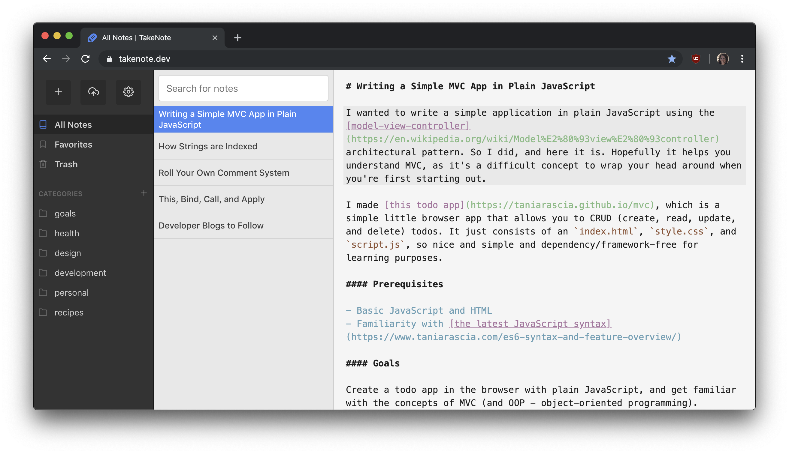

<p align="center">
  
</p>

<p align="center">
 
  <a href="#contributors"></a>
  <a href="https://travis-ci.org/taniarascia/takenote"></a>
  <a href="https://coveralls.io/github/taniarascia/takenote?branch=master"></a>
</p>

<p align="center">A web-based note-taking app with GitHub sync and Markdown support. (WIP)</p>



## Setup

### Install

```bash
git clone git@github.com:taniarascia/takenote
cd takenote
npm i
```

### Run

```bash
npm start
```

### Run in Docker

```bash
docker build -t takenote .
docker run -p 80:80 takenote
```

### Seed data

To seed the app with some test data, paste the contents of `seed.js` into your browser console and refresh.

## Features

- [x] Plain text notes with Markdown highlighting and frontmatter metadata
- [x] Add, update, download, temporarily delete and delete notes
- [x] Add, update, and delete categories
- [x] Add notes to categories or mark note as favorite
- [x] Keybinding shortcuts for common actions
- [x] Settings for light/dark mode, sync frequency, and Vim mode
- [x] Search notes
- [ ] Sync and store notes in GitHub gist (currently local storage)

## Contributing

TakeNote is an open source project, and contributions of any kind are welcome! Open issues, bugs, and enhancements are all listed on the [issues](https://github.com/taniarascia/takenote/issues) tab and labeled accordingly. Feel free to open bug tickets and make feature requests. Easy bugs and features will be tagged with the `good first issue` label.

The project is written in TypeScript, React and Redux. TypeScript is set to strict mode, with no implicit any allowed. The formatting style for the project is set by Prettier.

## Contributors

Thanks goes to these wonderful people:

<!-- ALL-CONTRIBUTORS-LIST:START - Do not remove or modify this section -->
<!-- prettier-ignore -->
<table>
  <tr>
    <td align="center"><a href="https://www.taniarascia.com"><br /><sub><b>Tania Rascia</b></sub></a><br /><a href="https://github.com/taniarascia/takenote/commits?author=taniarascia" title="Code">💻</a> <a href="#ideas-taniarascia" title="Ideas, Planning, & Feedback">🤔</a> <a href="https://github.com/taniarascia/takenote/issues?q=author%3Ataniarascia" title="Bug reports">🐛</a></td>
    <td align="center"><a href="https://github.com/hankolsen"><br /><sub><b>hankolsen</b></sub></a><br /><a href="https://github.com/taniarascia/takenote/commits?author=hankolsen" title="Code">💻</a> <a href="https://github.com/taniarascia/takenote/issues?q=author%3Ahankolsen" title="Bug reports">🐛</a></td>
    <td align="center"><a href="https://github.com/joseph-perez"><br /><sub><b>Joseph Perez</b></sub></a><br /><a href="https://github.com/taniarascia/takenote/commits?author=joseph-perez" title="Code">💻</a></td>
    <td align="center"><a href="https://cutting.scot"><br /><sub><b>Paul</b></sub></a><br /><a href="https://github.com/taniarascia/takenote/commits?author=dagda1" title="Code">💻</a> <a href="https://github.com/taniarascia/takenote/commits?author=dagda1" title="Tests">⚠️</a></td>
    <td align="center"><a href="https://martinbrosenberg.com/"><br /><sub><b>Martin Rosenberg</b></sub></a><br /><a href="https://github.com/taniarascia/takenote/commits?author=MartinRosenberg" title="Code">💻</a> <a href="https://github.com/taniarascia/takenote/issues?q=author%3AMartinRosenberg" title="Bug reports">🐛</a> <a href="#maintenance-MartinRosenberg" title="Maintenance">🚧</a></td>
    <td align="center"><a href="http://codepen.io/meowwwls"><br /><sub><b>Melissa</b></sub></a><br /><a href="https://github.com/taniarascia/takenote/commits?author=meowwwls" title="Code">💻</a></td>
    <td align="center"><a href="https://github.com/jjtowle"><br /><sub><b>Jason Towle</b></sub></a><br /><a href="https://github.com/taniarascia/takenote/commits?author=jjtowle" title="Code">💻</a></td>
  </tr>
  <tr>
    <td align="center"><a href="http://blog.isquaredsoftware.com"><br /><sub><b>Mark Erikson</b></sub></a><br /><a href="#ideas-markerikson" title="Ideas, Planning, & Feedback">🤔</a></td>
    <td align="center"><a href="http://www.alphonsebouy.fr"><br /><sub><b>Alphonse Bouy</b></sub></a><br /><a href="https://github.com/taniarascia/takenote/issues?q=author%3Aalphonseb" title="Bug reports">🐛</a></td>
    <td align="center"><a href="https://github.com/dave2kb"><br /><sub><b>dave2kb</b></sub></a><br /><a href="#design-dave2kb" title="Design">🎨</a> <a href="#ideas-dave2kb" title="Ideas, Planning, & Feedback">🤔</a></td>
    <td align="center"><a href="https://github.com/Dantaro"><br /><sub><b>Devin McIntyre</b></sub></a><br /><a href="https://github.com/taniarascia/takenote/commits?author=Dantaro" title="Code">💻</a></td>
    <td align="center"><a href="http://slofish.io"><br /><sub><b>Jeffrey Fisher</b></sub></a><br /><a href="https://github.com/taniarascia/takenote/issues?q=author%3Ajeffslofish" title="Bug reports">🐛</a></td>
    <td align="center"><a href="https://github.com/dong-alex"><br /><sub><b>Alex Dong</b></sub></a><br /><a href="https://github.com/taniarascia/takenote/commits?author=dong-alex" title="Code">💻</a></td>
    <td align="center"><a href="https://github.com/Publicker"><br /><sub><b>Publicker</b></sub></a><br /><a href="https://github.com/taniarascia/takenote/commits?author=Publicker" title="Code">💻</a></td>
  </tr>
  <tr>
    <td align="center"><a href="https://github.com/kleyu"><br /><sub><b>Jakub Naskręski</b></sub></a><br /><a href="https://github.com/taniarascia/takenote/commits?author=kleyu" title="Code">💻</a> <a href="https://github.com/taniarascia/takenote/issues?q=author%3Akleyu" title="Bug reports">🐛</a></td>
    <td align="center"><a href="https://opw0011.github.io/"><br /><sub><b>Benny O</b></sub></a><br /><a href="https://github.com/taniarascia/takenote/commits?author=opw0011" title="Code">💻</a></td>
    <td align="center"><a href="https://github.com/justDOindev"><br /><sub><b>Justin Payne</b></sub></a><br /><a href="https://github.com/taniarascia/takenote/commits?author=justDOindev" title="Code">💻</a></td>
    <td align="center"><a href="https://yikjin.github.io"><br /><sub><b>marshmallow</b></sub></a><br /><a href="#maintenance-yikjin" title="Maintenance">🚧</a></td>
  </tr>
</table>

<!-- ALL-CONTRIBUTORS-LIST:END -->

## Author

- [Tania Rascia](https://www.taniarascia.com)

## License

This project is open source and available under the [MIT License](LICENSE).
