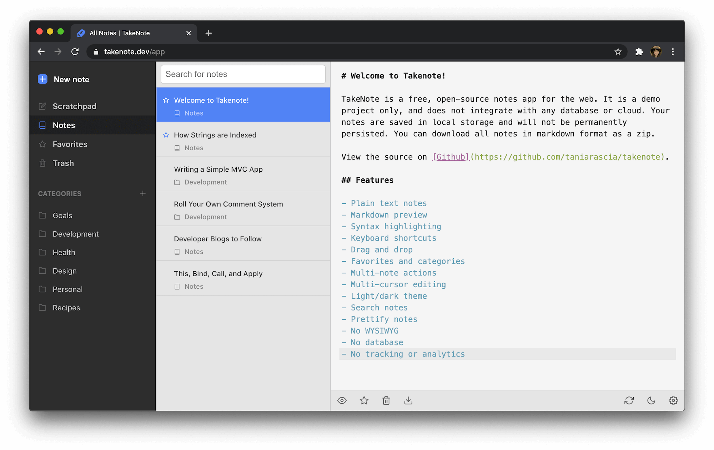

<p align="center">
  
</p>

<p align="center">
 
   <a href="https://app.netlify.com/sites/tnote/deploys"></a>
   <a href='https://coveralls.io/github/taniarascia/takenote'></a>
 </p>
 <p align="center">
   <a href="https://sonarcloud.io/dashboard?id=taniarascia_takenote"></a>
   <a href="https://sonarcloud.io/dashboard?id=taniarascia_takenote"></a>
   <a href="https://sonarcloud.io/api/project_badges/measure?project=taniarascia_takenote&metric=security_rating"></a>
   
</p>

<p align="center">A free, open-source notes app for the web. (Demo only)</p>

> **Note**: TakeNote is available as a demo only. You can use the app at [takenote.dev](https://takenote.dev) but the notes are only persisted in temporary local storage. However, you can download all notes as a zip.



## Features

- **Plain text notes** - take notes in an IDE-like environment that makes no assumptions
- **Markdown preview** - view rendered HTML
- **Linked notes** - Use `{{uuid}}` syntax to link to notes within other notes
- **Syntax highlighting** - light and dark mode available (based on the beautiful [New Moon theme](https://taniarascia.github.io/new-moon/))
- **Keyboard shortcuts** - use the keyboard for all common tasks - creating notes and categories, toggling settings, and other options
- **Drag and drop** - drag a note or multiple notes to categories, favorites, or trash
- **Multi-cursor editing** - supports multiple cursors and other [Codemirror](https://codemirror.net/) options
- **Search notes** - easily search all notes, or notes within a category
- **Prettify notes** - use Prettier on the fly for your Markdown
- **No WYSIWYG** - made for developers, by developers
- **No database** - notes are only stored in the browser's local storage and are available for download and export to you alone
- **No tracking or analytics** - 'nuff said
- **GitHub integration** - self-hosted option is available for auto-syncing to a GitHub repository (not available in the demo)

## About

TakeNote is a note-taking app for the web. You can use the demo app at [takenote.dev](https://takenote.dev). It is a static site without a database and does not sync your notes to the cloud. The notes are persisted temporarily in local storage, but you can download all notes in markdown format as a zip.

Hidden within the code is an alternate version that contain a Node/Express server and integration with GitHub. This version involves creating an OAuth application for GitHub and signing up to it with private repository permissions. Instead of backing up to local storage, your notes will back up to a private repository in your account called `takenote-data`. Due to the following reasons I'm choosing not to deploy or maintain this portion of the application:

- I do not want to maintain a free app with users alongside my career and other commitments
- I do not want to request private repository permissions from users
- I do not want to maintain an active server
- I do not want to worry about GitHub rate limiting from the server
- There is no way to batch create many files from the GitHub API, leading to a suboptimal GitHub storage solution

However, I'm leaving the code available so you can feel free to host your own TakeNote instance or study the code for learning purposes. I do not provide support or guidance for these purposes.

TakeNote was created with TypeScript, React, Redux, Node, Express, Codemirror, Webpack, Jest, Cypress, Feather Icons, ESLint, and Mousetrap, among other awesome open-source software.L

## Reviews

> _"I think the lack of extra crap is a feature."_ — Craig Lam

## Demo Development

Clone and install.

```bash
git clone git@github.com:taniarascia/takenote
cd takenote
npm i
```

Run a development server.

```bash
npm run client
```

## Full Application Development (self-hosted)

### Pre-Installation

Before working on TakeNote locally, you must create a GitHub OAuth app for development.

Go to your GitHub profile settings, and click on **Developer Settings**.

Click the **New OAuth App** button.

- **Application name**: TakeNote Development
- **Homepage URL**: `http://localhost:3000`
- **Authorization callback URL**: `http://localhost:3000/api/auth/callback`

Create a `.env` file in the root of the project, and add the app's client ID and secret. Remove `DEMO` variable to enable GitHub integration.

```bash
CLIENT_ID=xxx
CLIENT_SECRET=xxxx
DEMO=true
```

> Change the URLs to port `5000` in production mode or Docker.

### Installation

```bash
git clone git@github.com:taniarascia/takenote
cd takenote
npm i
```

#### Development mode

In the development environment, an Express server is running on port `5000` to handle all API calls, and a hot Webpack dev server is running on port `3000` for the React frontend. To run both of these servers concurrently, run the `dev` command.

```bash
npm run dev
```

Go to `localhost:3000` to view the app.

> API requests will be proxied to port `5000` automatically.

#### Production mode

In the production environment, the React app is built, and Express redirects all incoming requests to the `dist` directory on port `5000`.

```bash
npm run build && npm run start
```

Go to `localhost:5000` to view the app.

#### Run in Docker

Follow these instructions to build an image and run a container.

```bash
# Build Docker image
docker build --build-arg CLIENT_ID=xxx -t takenote:mytag .

# Run Docker container in port 5000
docker run \
-e CLIENT_ID=xxx \
-e CLIENT_SECRET=xxxx \
-e NODE_ENV=development \
-p 5000:5000 \
takenote:mytag
```

Go to `localhost:5000` to view the app.

> Note: You will see some errors during the installation phase, but these are simply warnings that unnecessary packages do not exist, since the Node Alpine base image is minimal.

### Seed data

To seed the app with some test data, paste the contents of `seed.js` into your browser console.

## Testing

Run unit and component/integration tests.

```bash
npm run test
```

> If using Jest Runner in VSCode, add `"jestrunner.configPath": "config/jest.config.js"` to your settings

Run Cypress end-to-end tests.

```bash
# In one window, run the application
npm run client

# In another window, run the end-to-end tests
npm run test:e2e:open
```

## Contributing

TakeNote is an open source project, and contributions of any kind are welcome and appreciated. Open issues, bugs, and feature requests are all listed on the [issues](https://github.com/taniarascia/takenote/issues) tab and labeled accordingly. Feel free to open bug tickets and make feature requests. Easy bugs and features will be tagged with the `good first issue` label.

View [CONTRIBUTING.md](CONTRIBUTING.md) to learn about the style guide, folder structure, scripts, and how to contribute.

## Contributors

Thanks goes to these wonderful people:

<!-- ALL-CONTRIBUTORS-LIST:START - Do not remove or modify this section -->
<!-- prettier-ignore-start -->
<!-- markdownlint-disable -->
<table>
  <tr>
    <td align="center"><a href="https://www.taniarascia.com"><br /><sub><b>Tania Rascia</b></sub></a><br /><a href="https://github.com/taniarascia/takenote/commits?author=taniarascia" title="Code">💻</a> <a href="#ideas-taniarascia" title="Ideas, Planning, & Feedback">🤔</a> <a href="https://github.com/taniarascia/takenote/issues?q=author%3Ataniarascia" title="Bug reports">🐛</a></td>
    <td align="center"><a href="https://github.com/hankolsen"><br /><sub><b>hankolsen</b></sub></a><br /><a href="https://github.com/taniarascia/takenote/commits?author=hankolsen" title="Code">💻</a> <a href="https://github.com/taniarascia/takenote/issues?q=author%3Ahankolsen" title="Bug reports">🐛</a> <a href="https://github.com/taniarascia/takenote/commits?author=hankolsen" title="Tests">⚠️</a></td>
    <td align="center"><a href="https://github.com/joseph-perez"><br /><sub><b>Joseph Perez</b></sub></a><br /><a href="https://github.com/taniarascia/takenote/commits?author=joseph-perez" title="Code">💻</a></td>
    <td align="center"><a href="https://cutting.scot"><br /><sub><b>Paul</b></sub></a><br /><a href="https://github.com/taniarascia/takenote/commits?author=dagda1" title="Code">💻</a> <a href="https://github.com/taniarascia/takenote/commits?author=dagda1" title="Tests">⚠️</a></td>
    <td align="center"><a href="https://martinbrosenberg.com/"><br /><sub><b>Martin Rosenberg</b></sub></a><br /><a href="https://github.com/taniarascia/takenote/commits?author=MartinRosenberg" title="Code">💻</a> <a href="https://github.com/taniarascia/takenote/issues?q=author%3AMartinRosenberg" title="Bug reports">🐛</a> <a href="#maintenance-MartinRosenberg" title="Maintenance">🚧</a></td>
    <td align="center"><a href="http://codepen.io/meowwwls"><br /><sub><b>Melissa</b></sub></a><br /><a href="https://github.com/taniarascia/takenote/commits?author=meowwwls" title="Code">💻</a></td>
    <td align="center"><a href="https://github.com/jjtowle"><br /><sub><b>Jason Towle</b></sub></a><br /><a href="https://github.com/taniarascia/takenote/commits?author=jjtowle" title="Code">💻</a></td>
  </tr>
  <tr>
    <td align="center"><a href="http://blog.isquaredsoftware.com"><br /><sub><b>Mark Erikson</b></sub></a><br /><a href="#ideas-markerikson" title="Ideas, Planning, & Feedback">🤔</a></td>
    <td align="center"><a href="http://www.alphonsebouy.fr"><br /><sub><b>Alphonse Bouy</b></sub></a><br /><a href="https://github.com/taniarascia/takenote/issues?q=author%3Aalphonseb" title="Bug reports">🐛</a></td>
    <td align="center"><a href="https://github.com/dave2kb"><br /><sub><b>dave2kb</b></sub></a><br /><a href="#design-dave2kb" title="Design">🎨</a> <a href="#ideas-dave2kb" title="Ideas, Planning, & Feedback">🤔</a></td>
    <td align="center"><a href="https://github.com/Dantaro"><br /><sub><b>Devin McIntyre</b></sub></a><br /><a href="https://github.com/taniarascia/takenote/commits?author=Dantaro" title="Code">💻</a></td>
    <td align="center"><a href="http://slofish.io"><br /><sub><b>Jeffrey Fisher</b></sub></a><br /><a href="https://github.com/taniarascia/takenote/issues?q=author%3Ajeffslofish" title="Bug reports">🐛</a></td>
    <td align="center"><a href="https://github.com/dong-alex"><br /><sub><b>Alex Dong</b></sub></a><br /><a href="https://github.com/taniarascia/takenote/commits?author=dong-alex" title="Code">💻</a></td>
    <td align="center"><a href="https://github.com/Publicker"><br /><sub><b>Publicker</b></sub></a><br /><a href="https://github.com/taniarascia/takenote/commits?author=Publicker" title="Code">💻</a></td>
  </tr>
  <tr>
    <td align="center"><a href="https://github.com/kleyu"><br /><sub><b>Jakub Naskręski</b></sub></a><br /><a href="https://github.com/taniarascia/takenote/commits?author=kleyu" title="Code">💻</a> <a href="https://github.com/taniarascia/takenote/issues?q=author%3Akleyu" title="Bug reports">🐛</a> <a href="https://github.com/taniarascia/takenote/commits?author=kleyu" title="Tests">⚠️</a></td>
    <td align="center"><a href="https://opw0011.github.io/"><br /><sub><b>Benny O</b></sub></a><br /><a href="https://github.com/taniarascia/takenote/commits?author=opw0011" title="Code">💻</a></td>
    <td align="center"><a href="https://github.com/justDOindev"><br /><sub><b>Justin Payne</b></sub></a><br /><a href="https://github.com/taniarascia/takenote/commits?author=justDOindev" title="Code">💻</a></td>
    <td align="center"><a href="https://yikjin.github.io"><br /><sub><b>marshmallow</b></sub></a><br /><a href="#maintenance-yikjin" title="Maintenance">🚧</a></td>
    <td align="center"><a href="http://jfelix.info"><br /><sub><b>Jose Felix </b></sub></a><br /><a href="https://github.com/taniarascia/takenote/commits?author=Jfelix61" title="Code">💻</a></td>
    <td align="center"><a href="https://xboston.dev"><br /><sub><b>Nikolay Kirsh</b></sub></a><br /><a href="https://github.com/taniarascia/takenote/commits?author=xboston" title="Code">💻</a></td>
    <td align="center"><a href="https://github.com/Mudassar045"><br /><sub><b>Mudassar Ali</b></sub></a><br /><a href="https://github.com/taniarascia/takenote/commits?author=Mudassar045" title="Code">💻</a></td>
  </tr>
  <tr>
    <td align="center"><a href="https://nathanbland.github.io/"><br /><sub><b>Nathan Bland</b></sub></a><br /><a href="https://github.com/taniarascia/takenote/issues?q=author%3ANathanBland" title="Bug reports">🐛</a> <a href="https://github.com/taniarascia/takenote/commits?author=NathanBland" title="Code">💻</a></td>
    <td align="center"><a href="http://craiglam.com"><br /><sub><b>Craig Lam</b></sub></a><br /><a href="https://github.com/taniarascia/takenote/commits?author=siliconeidolon" title="Code">💻</a> <a href="https://github.com/taniarascia/takenote/issues?q=author%3Asiliconeidolon" title="Bug reports">🐛</a> <a href="https://github.com/taniarascia/takenote/commits?author=siliconeidolon" title="Tests">⚠️</a></td>
    <td align="center"><a href="https://twitter.com/ashinzekene"><br /><sub><b>Ashinze Ekene</b></sub></a><br /><a href="https://github.com/taniarascia/takenote/issues?q=author%3Aashinzekene" title="Bug reports">🐛</a> <a href="https://github.com/taniarascia/takenote/commits?author=ashinzekene" title="Code">💻</a></td>
    <td align="center"><a href="https://adityasriram.ga"><br /><sub><b>Harry Sullivan</b></sub></a><br /><a href="https://github.com/taniarascia/takenote/commits?author=harrySullivan" title="Code">💻</a></td>
    <td align="center"><a href="https://github.com/moudev"><br /><sub><b>Mauricio Martínez</b></sub></a><br /><a href="https://github.com/taniarascia/takenote/commits?author=moudev" title="Code">💻</a></td>
    <td align="center"><a href="http://www.bugs.cc/"><br /><sub><b>Black-Hole</b></sub></a><br /><a href="https://github.com/taniarascia/takenote/commits?author=BlackHole1" title="Code">💻</a></td>
    <td align="center"><a href="https://zogan.de/"><br /><sub><b>Frank Blendinger</b></sub></a><br /><a href="https://github.com/taniarascia/takenote/commits?author=yogan" title="Code">💻</a></td>
  </tr>
  <tr>
    <td align="center"><a href="https://www.osiux.ws"><br /><sub><b>Eduardo Reveles</b></sub></a><br /><a href="https://github.com/taniarascia/takenote/commits?author=osiux" title="Code">💻</a></td>
    <td align="center"><a href="https://github.com/leofrozenyogurt"><br /><sub><b>Leo Royzengurt</b></sub></a><br /><a href="https://github.com/taniarascia/takenote/commits?author=leofrozenyogurt" title="Code">💻</a> <a href="https://github.com/taniarascia/takenote/issues?q=author%3Aleofrozenyogurt" title="Bug reports">🐛</a></td>
    <td align="center"><a href="https://github.com/kcvgan"><br /><sub><b>kcvgan</b></sub></a><br /><a href="https://github.com/taniarascia/takenote/commits?author=kcvgan" title="Code">💻</a> <a href="https://github.com/taniarascia/takenote/issues?q=author%3Akcvgan" title="Bug reports">🐛</a></td>
    <td align="center"><a href="https://github.com/codytowstik"><br /><sub><b>Cody Towstik</b></sub></a><br /><a href="https://github.com/taniarascia/takenote/commits?author=codytowstik" title="Code">💻</a> <a href="https://github.com/taniarascia/takenote/commits?author=codytowstik" title="Tests">⚠️</a> <a href="https://github.com/taniarascia/takenote/issues?q=author%3Acodytowstik" title="Bug reports">🐛</a></td>
    <td align="center"><a href="https://github.com/vincentdoerig"><br /><sub><b>Vincent Dörig</b></sub></a><br /><a href="https://github.com/taniarascia/takenote/commits?author=vincentdoerig" title="Tests">⚠️</a> <a href="https://github.com/taniarascia/takenote/commits?author=vincentdoerig" title="Code">💻</a></td>
    <td align="center"><a href="https://github.com/miqh"><br /><sub><b>Michael Huynh</b></sub></a><br /><a href="https://github.com/taniarascia/takenote/commits?author=miqh" title="Code">💻</a> <a href="https://github.com/taniarascia/takenote/issues?q=author%3Amiqh" title="Bug reports">🐛</a></td>
    <td align="center"><a href="https://github.com/code128"><br /><sub><b>Joshua Bloom</b></sub></a><br /><a href="https://github.com/taniarascia/takenote/commits?author=code128" title="Code">💻</a></td>
  </tr>
  <tr>
    <td align="center"><a href="https://github.com/Mxchaeltrxn"><br /><sub><b>Mxchaeltrxn</b></sub></a><br /><a href="https://github.com/taniarascia/takenote/commits?author=Mxchaeltrxn" title="Code">💻</a> <a href="https://github.com/taniarascia/takenote/commits?author=Mxchaeltrxn" title="Tests">⚠️</a></td>
    <td align="center"><a href="https://konradstaniszewski.com"><br /><sub><b>Konrad Staniszewski</b></sub></a><br /><a href="https://github.com/taniarascia/takenote/commits?author=KonradStanski" title="Documentation">📖</a></td>
    <td align="center"><a href="https://github.com/yohix"><br /><sub><b>Yohix</b></sub></a><br /><a href="#maintenance-yohix" title="Maintenance">🚧</a></td>
    <td align="center"><a href="https://github.com/jackson-elfers"><br /><sub><b>Jackson Elfers</b></sub></a><br /><a href="https://github.com/taniarascia/takenote/commits?author=jackson-elfers" title="Code">💻</a></td>
    <td align="center"><a href="https://github.com/vamshi-tg"><br /><sub><b>Vamshi</b></sub></a><br /><a href="https://github.com/taniarascia/takenote/commits?author=vamshi-tg" title="Code">💻</a></td>
    <td align="center"><a href="https://github.com/pavlakissimos"><br /><sub><b>Simos</b></sub></a><br /><a href="https://github.com/taniarascia/takenote/commits?author=pavlakissimos" title="Code">💻</a> <a href="https://github.com/taniarascia/takenote/commits?author=pavlakissimos" title="Tests">⚠️</a></td>
    <td align="center"><a href="https://github.com/ggonza89"><br /><sub><b>Yankee</b></sub></a><br /><a href="https://github.com/taniarascia/takenote/commits?author=ggonza89" title="Code">💻</a> <a href="#ideas-ggonza89" title="Ideas, Planning, & Feedback">🤔</a> <a href="https://github.com/taniarascia/takenote/commits?author=ggonza89" title="Tests">⚠️</a></td>
  </tr>
  <tr>
    <td align="center"><a href="https://github.com/G-Milevski"><br /><sub><b>G-Milevski</b></sub></a><br /><a href="https://github.com/taniarascia/takenote/commits?author=G-Milevski" title="Code">💻</a></td>
    <td align="center"><a href="https://kodyclemens.com"><br /><sub><b>Kody Clemens</b></sub></a><br /><a href="https://github.com/taniarascia/takenote/commits?author=kodyclemens" title="Code">💻</a> <a href="https://github.com/taniarascia/takenote/commits?author=kodyclemens" title="Tests">⚠️</a> <a href="https://github.com/taniarascia/takenote/issues?q=author%3Akodyclemens" title="Bug reports">🐛</a></td>
    <td align="center"><a href="https://github.com/qpeela"><br /><sub><b>Vladimir Yamshikov</b></sub></a><br /><a href="https://github.com/taniarascia/takenote/commits?author=qpeela" title="Code">💻</a> <a href="https://github.com/taniarascia/takenote/issues?q=author%3Aqpeela" title="Bug reports">🐛</a></td>
    <td align="center"><a href="https://about.me/ronan696"><br /><sub><b>Ronan D'Souza</b></sub></a><br /><a href="https://github.com/taniarascia/takenote/commits?author=ronan696" title="Code">💻</a></td>
    <td align="center"><a href="http://modprog.de"><br /><sub><b>Roland Fredenhagen</b></sub></a><br /><a href="https://github.com/taniarascia/takenote/commits?author=ModProg" title="Code">💻</a></td>
    <td align="center"><a href="https://github.com/PranjaliPatil14"><br /><sub><b>Pranjali Pramod Patil</b></sub></a><br /><a href="https://github.com/taniarascia/takenote/commits?author=PranjaliPatil14" title="Tests">⚠️</a></td>
    <td align="center"><a href="https://cbrgm.net"><br /><sub><b>Chris Bargmann</b></sub></a><br /><a href="#ideas-cbrgm" title="Ideas, Planning, & Feedback">🤔</a> <a href="https://github.com/taniarascia/takenote/commits?author=cbrgm" title="Code">💻</a></td>
  </tr>
  <tr>
    <td align="center"><a href="https://www.linkedin.com/in/jadhielv"><br /><sub><b>Jadhiel Vélez</b></sub></a><br /><a href="https://github.com/taniarascia/takenote/commits?author=Jadhielv" title="Code">💻</a> <a href="https://github.com/taniarascia/takenote/issues?q=author%3AJadhielv" title="Bug reports">🐛</a></td>
  </tr>
</table>

<!-- markdownlint-enable -->
<!-- prettier-ignore-end -->

<!-- ALL-CONTRIBUTORS-LIST:END -->

## Acknowledgements

- A big thank you to [David Bock](https://dkbock.com/) for logo design.

## Author

- [Tania Rascia](https://www.taniarascia.com)

## License

This project is open source and available under the [MIT License](LICENSE).
